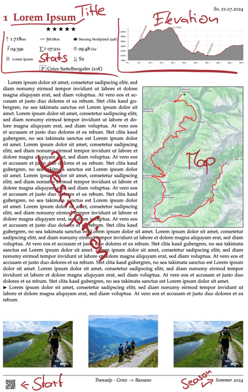

# :books: tourenbuchctl


This is a tool for working with my `tourenbuch`.

`Tourenbuch` is a digital & printed log book of my personal outdoor sports activities.
Each activity consists of gpx tracks, map, stats, plotted elevation graphs and an
overall summaray/description.

This CLI helps me to interact with it. Until i release more information about
my (private) Tourenbuch, it's  probabaly not useful for anyone.

See the example of an activity page below:

<p align="center" width="100%">
    <kbd>
        
    </kbd>
</p>

# :grey_question: How does this work
I have two directories set up:
  * ~/tourenbuch (<- a (private) git repository containing my written/text elements)
  * ~/tourenbuchassets (<- a cloud synced folder containing my images/gpx/asset elements)

# :mountain_bicyclist: Usage

### New Single Day activity
```sh
tourenbuchctl new mtb <directory.name> -d <dd.mm.YYYY> -t "<activity.title>"
tourenbuchctl new skitour <directory.name> --max-elevation <1234> -d <dd.mm.YYYY> -t "<activity.title>"

```

### New Multiday activity
```sh
tourenbuchctl new mtb transalp-2013/<directory.name> -d <dd.mm.YYYY> -t '<activity.title>' -m -c "<participants>" -y <descent.difficulty> -r <rating.in.stars>
```

# :hammer: Tech Details

## Strava
Activity stats like distance or climbed elevation get queried from strava and
parsed in the Tourenbuch.

# Dev

## Prerequisites
### Swagger
Go-swagger is incompatible with 3.x api defintion of strava...
And strava declared their current 3.x api incompatible with swaggerv3. I played
around with different `2.x` releases, which in fact generated a different codebase.
I [struggled with](#13) `swagger-codegen-cli-v3:3.0.58` on the `ActivitiesApiUpdateActivityByIdOpts`,
switching to `2.4.43` solved the problem, though generated a wrong `model_lat_long.go`, which i
had [to patch](https://github.com/nce/tourenbuchctl/blob/e2147617af8eaaae55847c9ee69f8fa6b2eb1e41/pkg/stravaapi/model_lat_lng.go#L12-L16).

Refer to the [Makefile](Makefile) for the current swagger build.
