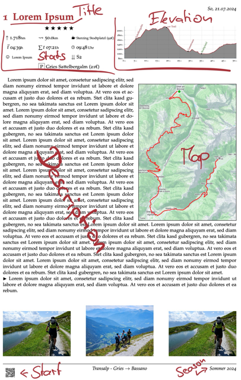

# :books: tourenbuchctl


`tourenbuchctl` is a personal command-line helper for maintaining my
`Tourenbuch`.

The Tourenbuch is a digital and printed logbook for outdoor activities such as
mountain biking, ski touring, and hiking. Each activity page combines a written
description with structured metadata, GPX tracks, maps, statistics, photos, and
an elevation profile. The final result is rendered as a PDF page that can be
printed or published.

This repository is public, but the workflow is highly tailored to my private
Tourenbuch repository, my local folder layout, and my Strava account. It is
therefore more useful as a reference for the workflow than as a ready-made tool
for other users.

Example of a generated activity page:

<p align="center" width="100%">
    <kbd>
        
    </kbd>
</p>

# :grey_question: How does this work

The Tourenbuch data is split across two local folders:

* `textdir`: a private Git repository containing the written parts of each
  activity, such as `header.yaml`, `description.md`, `elevation.plt`, and
  `images.tex`
* `assetdir`: a cloud-synced folder containing larger assets such as images,
  GPX files, rendered PDFs, and shared helper scripts

An activity exists in both folders. The text directory stores the editable
source files, while the asset directory stores the GPX track and images used
when rendering the final page. Single-day activities are named in the format
`name-DD.MM.YYYY`; multi-day activities live below a `multidaytrip` directory.

The CLI can scaffold a new activity from embedded templates, pull statistics and
GPX tracks from Strava, render a PDF via Pandoc, LaTeX, Gnuplot, and a GPX
plotting helper, and generate Markdown statistics over the existing activity
library.

Configuration is read from `~/.tourenbuchctl`. At minimum, the file needs the
Strava OAuth credentials and the configured activity types used by the local
Tourenbuch:

```yaml
STRAVA_CLIENT_ID: "..."
STRAVA_CLIENT_SECRET: "..."
activities:
  - mtb
  - skitour
  - wandern
```

Several paths are currently hard-coded to my local setup, so using the tool
elsewhere requires code changes.

# :mountain_bicyclist: Usage

## Create a new activity

`tourenbuchctl new` creates the folder structure and starter files for a new
Tourenbuch entry. It can also immediately sync matching Strava data and the GPX
track for the selected date.

Supported activity commands are:

* `tourenbuchctl new mtb [name]`
* `tourenbuchctl new skitour [name]`
* `tourenbuchctl new hike [name]`

Common flags:

* `--date`, `-d`: activity date in `DD.MM.YYYY` format; required
* `--title`, `-t`: title shown on the rendered page; required
* `--company`, `-c`: participants
* `--restaurant`: restaurant or break location
* `--rating`, `-r`: rating from 1 to 5, rendered as stars
* `--multi`, `-m`: create the activity below the multi-day trip layout
* `--sync`, `-s`: fetch statistics from Strava; enabled by default
* `--gpx`, `-g`: export the Strava GPX track; enabled by default
* `--start-location`, `-l`: interactively select or create a start-location QR
  reference; enabled by default

Activity-specific flags:

* `mtb`: `--difficulty`, `-y` for trail difficulty on the S scale
* `skitour`: `--max-elevation` for the highest elevation in meters

Examples:

```sh
tourenbuchctl new mtb <directory.name> -d <dd.mm.YYYY> -t "<activity.title>"
tourenbuchctl new skitour <directory.name> --max-elevation <1234> -d <dd.mm.YYYY> -t "<activity.title>"
```

For a multi-day activity:

```sh
tourenbuchctl new mtb transalp-2013/<directory.name> -d <dd.mm.YYYY> -t '<activity.title>' -m -c "<participants>" -y <descent.difficulty> -r <rating.in.stars>
```

## Sync Strava data

`tourenbuchctl sync` updates an existing activity with Strava statistics and/or
the GPX track. It interactively selects the Tourenbuch activity, then searches
Strava for activities on the matching date.

```sh
tourenbuchctl sync
tourenbuchctl sync -d <dd.mm.YYYY>
tourenbuchctl sync --sync=false
tourenbuchctl sync --gpx=false
```

The command writes statistics back into the activity metadata and stores the GPX
as `input.gpx` in the asset directory.

## Render an activity page

`tourenbuchctl gen` renders the current activity directory as a single-page PDF.
Run it from a directory that contains an activity `header.yaml` and
`description.md`.

```sh
tourenbuchctl gen
tourenbuchctl gen --save
tourenbuchctl gen --upload
tourenbuchctl gen --compress
tourenbuchctl gen --prevent-cleanup
```

Useful flags:

* `--save`, `-s`: save the rendered PDF to the local asset directory
* `--upload`, `-u`: upload the PDF to the configured object storage bucket
* `--compress`, `-c`: compress the PDF after rendering
* `--prevent-cleanup`, `-x`: keep temporary rendering files for debugging

## Generate statistics

`tourenbuchctl stats` scans the configured activity folders and writes a
Markdown table to standard output.

```sh
tourenbuchctl stats
tourenbuchctl stats -t mtb
tourenbuchctl stats -t mtb,skitour
tourenbuchctl stats --regional-grouping
```

Useful flags:

* `--activity-type`, `-t`: filter activity types, or use `all`
* `--regional-grouping`, `-r`: group the output by region
* `--output-format`, `-o`: output format; currently Markdown is implemented

## Migrate old activity folders

`tourenbuchctl migrate` updates an activity directory from older file layouts to
the current structure. Run it from inside the activity directory.

```sh
tourenbuchctl migrate
```

It splits older combined description files, moves image includes into
`images.tex`, removes obsolete files, reduces elevation data to labels, and
updates the stored format version.

# :hammer: Tech Details

## Strava

Activity statistics such as distance, ascent, start time, elapsed time, and
moving time are fetched from Strava. The sync flow opens the Strava OAuth login
in the browser when no valid token is available, then stores the temporary token
in `/tmp/stravatoken.json`.

When multiple Strava activities exist on the same date, the CLI asks which one
should be used. The selected activity is written into the Tourenbuch metadata,
and the GPX track can be exported into the matching asset directory.

# Dev

## Prerequisites
### Swagger
Go-swagger is incompatible with 3.x api defintion of strava...
And strava declared their current 3.x api incompatible with swaggerv3. I played
around with different `2.x` releases, which in fact generated a different codebase.
I [struggled with](#13) `swagger-codegen-cli-v3:3.0.58` on the `ActivitiesApiUpdateActivityByIdOpts`,
switching to `2.4.43` solved the problem, though generated a wrong `model_lat_long.go`, which i
had [to patch](https://github.com/nce/tourenbuchctl/blob/e2147617af8eaaae55847c9ee69f8fa6b2eb1e41/pkg/stravaapi/model_lat_lng.go#L12-L16).

Refer to the [Makefile](Makefile) for the current swagger build.
